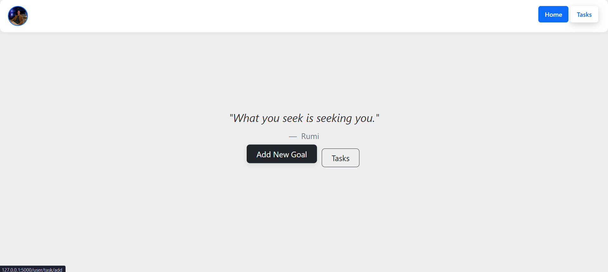
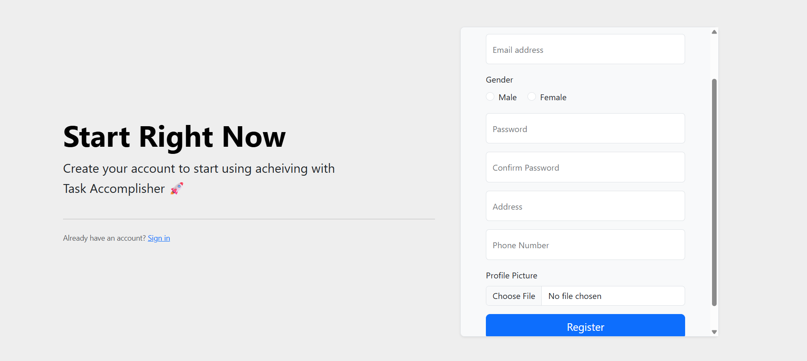
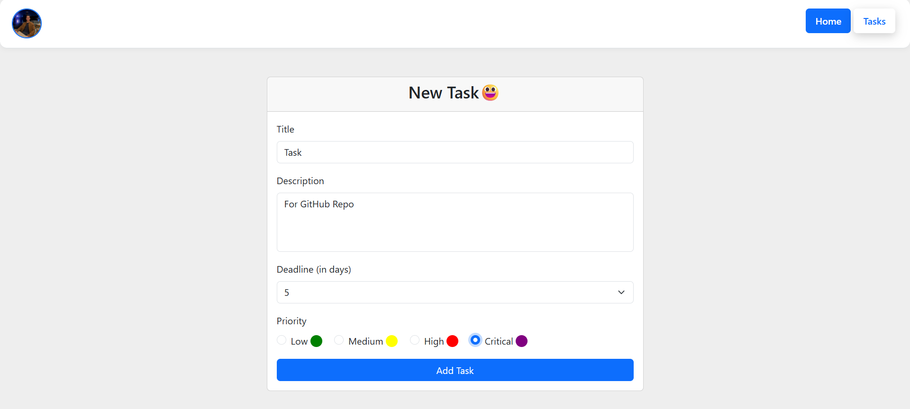
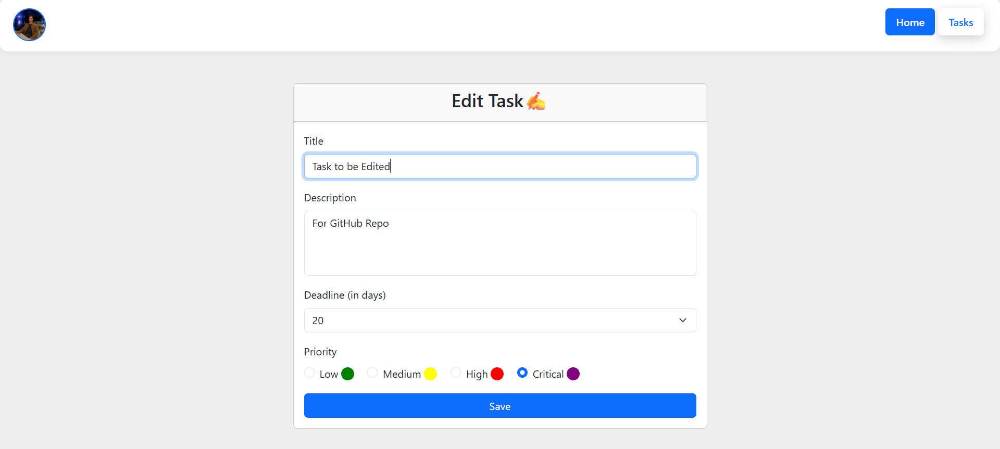
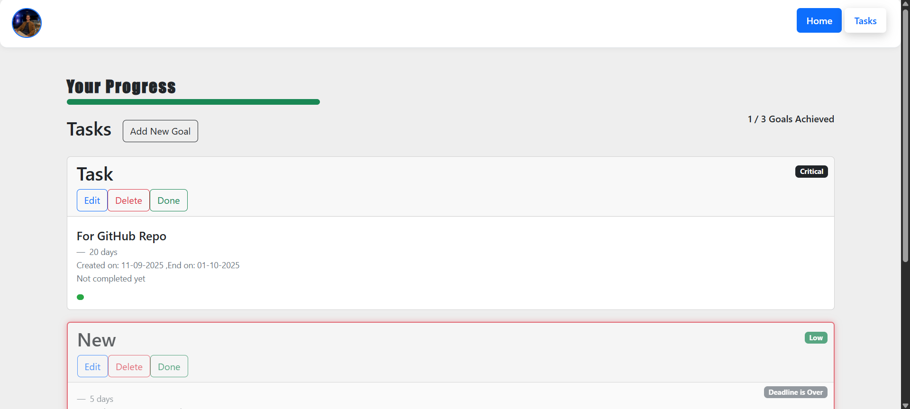
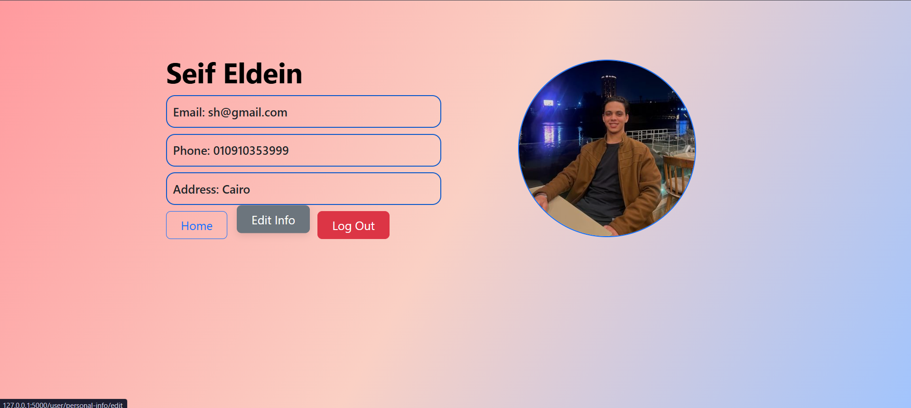
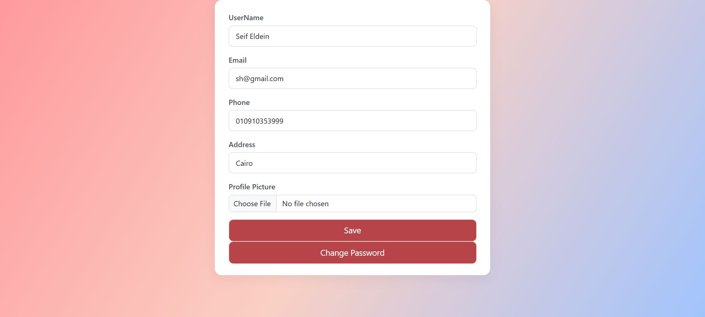

# Task-Accomplisher
# 📝 Task Accomplisher  

**Task Accomplisher** is a full-stack **Flask-based web application** designed to help users organize, track, and complete their tasks efficiently. It provides an intuitive dashboard where users can add, edit, delete, and monitor tasks with deadlines, while also keeping track of their progress through a visual timeline and achievement bar. The app also supports user authentication, secure profile management, and a responsive design for a smooth experience across devices.  

---

## 🌟 What is Task Accomplisher?  

Task Accomplisher is more than just a to-do list — it’s a **personal productivity assistant**.  
It is designed to:  

- Help users **create and manage tasks** with priorities and deadlines.  
- Show **progress visualization** so users can see how much time they have before a task is due.  
- Provide a **personal dashboard** with completed vs total tasks.  
- Allow users to **register, log in securely, and manage their profiles**, including uploading profile pictures.  

This makes it suitable for students, professionals, and anyone who wants to **stay organized** and **accomplish more**.  

---

## 🔧 Technologies Used  

### Backend  
- **Flask** – Lightweight Python web framework for routing and request handling 
- **Flask-WTF** – Simplifies Form handling & validation  
- **Flask-Bcrypt** – Secure password hashing for authentication
- **Flask-Migrate** – Handles Database migrations  
- **SQLAlchemy** – ORM for database management  
- **Flask Sessions** – Stores user-specific data (like login state, preferences, or temporary variables) securely between requests, enabling personalized experiences and authentication workflows

### Frontend  
- **Custom CSS** – Enhanced styling and animations  
- **Vanilla JavaScript** – Interactive features (typewriter effect, progress bar animations, password toggle, etc.)  
- **Bootstrap 5** – Responsive styling & layout  
- **Bootstrap Icons** – Icon set for better UI  
- **Responsive Layouts** – Flexible system & media queries ensure usability across devices

### Database & File Handling  
- **SQLite** (default, can be replaced with PostgreSQL or MySQL)  
- **UUID** – Unique naming for uploaded profile pictures
- **Werkzeug `secure_filename`** – Safe file upload handling  

### ⚙️ Other Core Technologies

- **Jinja2 Templating** – Renders dynamic HTML pages from backend data

- **WTForms CSRF Protection** – Adds extra security to forms against CSRF attacks
<!-- - **Flask-Login** – Manages user session handling & authentication -->

- **Responsive UI/UX Principles** – Designed mobile-first with accessibility in mind
---
## 🔐 Security Highlights

- **Passwords are securely hashed** using bcrypt (never stored in plain text).
- **CSRF protection** – via Flask-WTF. 
- Safe file uploads with **UUID renaming** – + `secure_filename`.
---
## 📸 Example Screens 

- **Homepage** – Clean landing page with navigation.
 
 


- **User Dashboard** – Displays active and completed tasks.


- **Registeration and Log in** – Easy apply for Registeration and log in
 
 

- **Add, Edit and Delete Tasks** – with the ability to mark **Done**
 
 

- **Task Timeline and Tasks categories** – Visual progress bar showing deadline tracking and Classified into ongoing, completed and overdue.
 
 

- **Profile Page** – Edit username, email, phone, address, photo and password.
 


---

## ⚙️ Installation & Setup  

Follow these steps to run the project locally:  

1. **Clone the repository**  
```bash
git clone https://github.com/yourusername/task-accomplisher.git
cd task-accomplisher
```
2. **Install vertual env**  
```bash
pip install virtualenv
```
3. **Create a virtual environment**  
```bash
python -m venv venv
```
4. **Activate virtual environment**
>Windows
```bash
venv\Scripts\activate
```
>Mac/Linux
```bash
source venv/bin/activate
```
5. **Install dependencies**
```bash
pip install -r requirements.txt
```
6. **Set up the database**
```bash
flask --app app db init
flask --app app db migrate -m "Initial migration"
flask --app app db upgrade

```
7. **Run the application**
```bash
flask --app app run
```
8. **Open your browser and visit:**
[http://127.0.0.1:5000](http://127.0.0.1:5000)
_(open in new tab)_


--- 

## 🚀 Future Enhancements

- **Email verification & password reset**

- **Task categorization & filtering**

- **Overdue task notifications**

- **Multi-user task collaboration**

---


